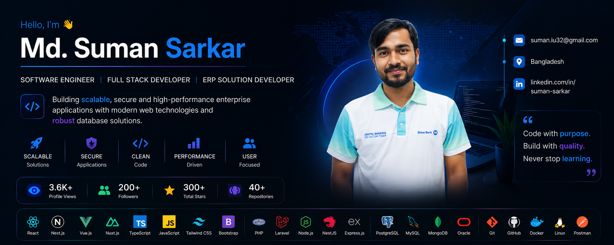

  

<h1 align="center">Hi 👋, I'm Md. Suman Sarkar</h1>

<h3 align="center">
Software Engineer • Full Stack Developer • ERP Solution Developer
</h3>

Building scalable enterprise applications with modern web technologies and robust database solutions.

---

---

# 👨‍💻 About Me

- 🚀 Software Engineer passionate about scalable software.
- 💼 Enterprise ERP Developer.
- 🌱 Currently learning Cloud, Docker & System Design.
- 💬 Ask me about Laravel, React, Vue, Next.js, NestJS, Oracle & PostgreSQL.
- ⚡ Love building enterprise software.
- 📫 **suman.iu32@gmail.com**

---

# 💻 Tech Stack

## Frontend

## Backend

## Database

## DevOps & Tools

---

# 🎯 Professional Expertise

| ✔ Expertise | ✔ Expertise |
|------------|------------|
| Enterprise ERP Development | REST API Development |
| Full Stack Development | Backend Architecture |
| Database Optimization | Oracle Database |
| Performance Optimization | Report Generation |
| Software Maintenance | System Integration |

---

# 🏢 ERP Domains

🧑‍💼 Human Resource Management

💰 Finance & Accounting

📦 Material Management

🏭 Production Planning

🛒 Purchase & Sales

📊 Reporting & Analytics

📈 MIS Dashboard

---

# 🔥 GitHub Streak

---

# 📈 Contribution Graph

---

# 🌐 Connect With Me

---

# 💡 Quote

> **Code with purpose. Build with quality. Never stop learning.**

---

### ⭐ Thanks for visiting my profile!

If you like my work, don't forget to ⭐ my repositories and follow me.

